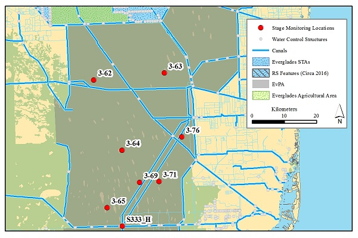

`r paste("Updated",as.POSIXct(Sys.time(),"%Y-%m-%d %H:%M",tz=""))`

This webpage is intended to inform Agency representatives on stage elevation in the various waterbodies within the Everglades Region (North and South). 

**_Please note this analysis is using preliminary data and subject to change._** 
```{r Libraries_paths_Dates,include=FALSE}
rm(list=ls(all=T)); 
#libraries
library(lubridate)
library(plyr)
library(reshape)
library(maptools)
library(classInt)
library(GISTools)
library(zoo)
library(colorRamps)
library(dataRetrieval)
library(leaflet)

#Function

SFWMD.DBHYDRO.Data.breakpoint=function(SDATE,EDATE,DBK,col.names=c("DATETIME","Station","DBKEY","Data.Value","Flag","Comment")){
  DBK.val=paste("",DBK,"",collapse="/",sep="")
  SDATE=paste(format(SDATE,"%Y"),toupper(format(SDATE,"%m")),format(SDATE,"%d"),sep="");#In YYYYMMDD format
  EDATE=paste(format(EDATE,"%Y"),toupper(format(EDATE,"%m")),format(EDATE,"%d"),sep="");#In YYYYMMDD format
  link=paste("http://my.sfwmd.gov/dbhydroplsql/web_io.report_process?v_period=uspec&v_start_date=",SDATE,"&v_end_date=",EDATE,"&v_report_type=format6&v_target_code=file_csv&v_run_mode=onLine&v_js_flag=Y&v_dbkey=",DBK.val,sep="")
  REPORT=read.csv(link,skip=length(DBK)+2,col.names=col.names)[,1:6]
  REPORT$DATETIME=as.POSIXct(REPORT$DATETIME,format="%d-%b-%Y %H:%M",tz="EST")
  REPORT$DATE=as.POSIXct(format(REPORT$DATETIME,format="%Y-%m-%d"))
  REPORT=subset(REPORT,is.na(DATETIME)==F)
  return(REPORT)
}
SFWMD.DBHYDRO.Data.daily=function(SDATE,EDATE,DBK){
  DBK.val=paste("",DBK,"",collapse="/",sep="")
  SDATE=paste(format(SDATE,"%Y"),toupper(format(SDATE,"%m")),format(SDATE,"%d"),sep="");#In YYYYMMDD format
  EDATE=paste(format(EDATE,"%Y"),toupper(format(EDATE,"%m")),format(EDATE,"%d"),sep="");#In YYYYMMDD format
  link=paste("http://my.sfwmd.gov/dbhydroplsql/web_io.report_process?v_period=uspec&v_start_date=",SDATE,"&v_end_date=",EDATE,"&v_report_type=format6&v_target_code=file_csv&v_run_mode=onLine&v_js_flag=Y&v_dbkey=",DBK.val,sep="")
  REPORT=read.csv(link,skip=length(DBK)+2)
  REPORT$Date=with(REPORT,as.POSIXct(as.character(Daily.Date),format="%d-%b-%Y",tz="America/New_York"))
  REPORT=subset(REPORT,is.na(Date)==F)
  return(REPORT)
}

axis_fun=function(side,at,at2,labels,cex.axis,line=-0.25){
  axis(side,line=line,at=at,labels=labels,las=1,tcl=-0.6,lty=0,cex.axis=cex.axis);
  axis(side,at=at,labels=F,las=1,tcl=-0.6);
  axis(side,at=at2,labels=F,tcl=-0.3)
}
pt_line=function(x,y,ln.lty,ln.col,ln.lwd,pch,bg,cex=1,pt.lwd=1,pt.lty=1,pt.col="grey"){
  lines(x,y,lty=ln.lty,col=ln.col,lwd=ln.lwd)
  points(x,y,pch=pch,lty=pt.lty,col=pt.col,lwd=pt.lwd,bg=bg,cex=cex)
}
date.fun=function(x,tz="EST",form="%F")as.POSIXct(strptime(x,form),tz=tz)
N=function(x,NA.val="NA") length(which(x!=NA.val))
SE=function(x,NA.val="NA") sd(x,na.rm=T)/sqrt(length(which(x!=NA.val)))
lagpad <- function(x, k) {
    if (!is.vector(x)) 
        stop('x must be a vector')
    if (!is.numeric(x)) 
        stop('x must be numeric')
    if (!is.numeric(k))
        stop('k must be numeric')
    if (1 != length(k))
        stop('k must be a single number')
    c(rep(NA, k), x)[1 : length(x)] 
}
shaded.range=function(x,y.L,y.U,bg,col=bg,lty=3,col.adj=0.25,lwd=1){
  xx=c(x,rev(x))
  yy=c(y.L,rev(y.U))
  polygon(xx,yy,col=adjustcolor(bg,col.adj),border=col,lty=lty,lwd=lwd)
}

#Paths

#Current WY
CurWY=as.numeric(ifelse(as.numeric(format(as.Date(Sys.time()),"%m"))>4,as.numeric(format(as.Date(Sys.time()),"%Y"))+1,format(as.Date(Sys.time()),"%Y")))
CurWY

## Stage Data
TODAY=as.POSIXct(strptime(Sys.time(),"%F"),tz="EST")
YEST=TODAY-duration(1,"days")
End.Date=as.Date(Sys.time())+duration(1,"days")

Start.Date=as.Date(paste(CurWY-2,05,01,sep="-"))
Start.Date2=min(as.Date(Sys.time())-duration(35,"days"),as.Date(paste(CurWY-1,05,01,sep="-")))

STG.SDate=paste(format(Start.Date,"%Y"),format(Start.Date,"%m"),format(Start.Date,"%d"),sep="")
STG.EDate=paste(format(End.Date,"%Y"),format(End.Date,"%m"),format(End.Date,"%d"),sep="")

#For Plots
dates=c(Start.Date2,as.Date(Start.Date2+duration(366,"days")))
xlim.vals=as.POSIXct(strptime(dates,"%Y-%m-%d"),tz="EST")
xmaj=seq(xlim.vals[1],xlim.vals[2],by="2 months");xmin=seq(xlim.vals[1],xlim.vals[2],by="1 months")

#DBKeys master list
#dbkeys=read.csv(paste0(data.path,"DBKeys_List.csv"),na.string=999)

## need to clean this up
dbkeys=data.frame(SITE = c("S62HW", "S59HW", "S62TW", "S61HW","S57HW", "S58HW", "S60HW", "ALLI", "S63HW", "S65HW", "LKIS5B",
"LHATCH3", "LCYP19", "S61TW", "S68HW","ITKP01", "L001","L005", "L006", "LZ40", "S133TW", "S352HW", "S4TW", "RottN", 
"RottS", "Holey1", "G203D", "G204HW", "G205HW", "G206HW", "Holey2","CA17", "CA19", "CA18C", "CA18T", "CA217", "CA219", "S11BHW", 
"CA363", "CA364", "CA365", "CA369", "CA371", "CA362", "S333HW","S333TW", "S334HW", "G3273", "CA376", "CA369", "S308HW", "NP205", 
"P44", "P38", "NP112", "NP206", "RG2","SWEVER4"),
DA = c("WN219", "WN265","WN221", "WN255", "WN239", "15529", "WN260", "FZ586", "WN328","WN313", "90324", "T0937", "16050", "WN257", "15956","TB028", "16022", "12509", "12519", "16265", "15826", "FF579","15732", "W1953", "VW863", "VW980", "13157", "15052", "15055","15058", "W1925", "15808", "15811", "15810", "15809", "16531","16530", "WN126", "16532", "16537", "16538", "16541", "16543","16536", "AJ013", "AJ015", "DJ184", "05738", "16539", "16541", NA,"G6146", "G6156", "G6160", "H2427", "06721", "H6067","05783"), 
BK = c("WN220","WN266", "WN222", "WN256", "WN240", "IY773", "WN261", "IW786","WN329", "WN314",NA, "T0938", "IX917", "WN258", "IY883", "TB029", "IX846", "IX865", "IX875", "IY030", NA,"IY688", "IY763", "W1954", "VW864", "VW981", "IX378", "IX380","IX382", "IX384", "W1926", "AI481", "AI484", "AI482", "AI483","AI485", "AI487", "AI511", "AI493", "AI494", "AI495", NA,"AI497", "AI492", "AJ014", "AJ016", "IY636", "IX345", NA, NA,"AI522", NA, NA, NA, NA, NA, NA,NA), 
WaterBody = c("Hart", "EToho","EToho", "Toho", "Myrtle", "Trout", "Trout", "Trout", "Gentry","Kissimmee", "Kissimmee", "Hatchineha", "Hatchineha", "Hatchineha","Istokpoga", "Istokpoga", "Okeechobee", "Okeechobee","Okeechobee", "Okeechobee", "Okeechobee", "Okeechobee", "Okeechobee","ROTEN", "ROTEN", "Holey", "Holey", "Holey", "Holey", "Holey", 
"Holey", "WCA1", "WCA1", "WCA1", "WCA1", "WCA2", "WCA2", "WCA2","WCA3", "WCA3", "WCA3", "WCA3", "WCA3", "WCA3", "WCA3", "ENP_L29","ENP_L29", "ENP_G3273", "WCA3", "WCA3", "Okeechobee", "ENP_CSSS","ENP_CSSS", "ENP_CSSS", "ENP_CSSS", "ENP_CSSS","ENP_CSSS","ENP_CSSS"))

dbkeys=subset(dbkeys,WaterBody!="Okeechobee")
dbkeys=rbind(dbkeys,
             data.frame(SITE=rep("LAKEOKEE",2),DA=c("N3466","06832"),BK=NA,WaterBody="Okeechobee"))


#dbkeys=data.frame(SITE = c("S62HW", "S59HW", "S62TW", "S61HW","S57HW", "S58HW", "S60HW", "ALLI", "S63HW", "S65HW", "LKIS5B",
#"LHATCH3", "LCYP19", "S61TW", "S68HW", "ITKP03", "ITKP01", "L001","L005", "L006", "LZ40", "S133TW", "S352HW", "S4TW", "RottN", 
#"RottS", "Holey1", "G203D", "G204HW", "G205HW", "G206HW", "Holey2","CA17", "CA19", "CA18C", "CA18T", "CA217", "CA219", "S11BHW", 
#"CA363", "CA364", "CA365", "CA369", "CA371", "CA362", "S333HW","S333TW", "S334HW", "G3273", "CA376", "CA369", "S308HW", "NP205", 
#"P44", "P38", "NP112", "NP206", "RG2","SWEVER4"),
#DA = c("WN219", "WN265","WN221", "WN255", "WN239", "15529", "WN260", "FZ586", "WN328","WN313", "90324", "T0937", "16050", "WN257", "15956", "UT760", "TB028", "16022", "12509", "12519", "16265", "15826", "FF579","15732", "W1953", "VW863", "VW980", "13157", "15052", "15055","15058", "W1925", "15808", "15811", "15810", "15809", "16531","16530", "WN126", "16532", "16537", "16538", "16541", "16543","16536", "AJ013", "AJ015", "DJ184", "05738", "16539", NA, NA,"G6146", "G6156", "G6160", "H2427", "06721", "H6067","05783"), 
#BK = c("WN220","WN266", "WN222", "WN256", "WN240", "IY773", "WN261", "IW786","WN329", "WN314", "90325", "T0938", "IX917", "WN258", "IY883",NA, "TB029", "IX846", "IX865", "IX875", "IY030", "IY368","IY688", "IY763", "W1954", "VW864", "VW981", "IX378", "IX380","IX382", "IX384", "W1926", "AI481", "AI484", "AI482", "AI483","AI485", "AI487", "AI511", "AI493", "AI494", "AI495", NA,"AI497", "AI492", "AJ014", "AJ016", "IY636", "IX345", NA, NA,NA, NA, NA, NA, NA, NA, NA,NA), 
#WaterBody = c("Hart", "EToho","EToho", "Toho", "Myrtle", "Trout", "Trout", "Trout", "Gentry","Kissimmee", "Kissimmee", "Hatchineha", "Hatchineha", "Hatchineha","Istokpoga", "Istokpoga", "Istokpoga", "Okeechobee", "Okeechobee","Okeechobee", "Okeechobee", "Okeechobee", "Okeechobee", "Okeechobee","ROTEN", "ROTEN", "Holey", "Holey", "Holey", "Holey", "Holey", 
#"Holey", "WCA1", "WCA1", "WCA1", "WCA1", "WCA2", "WCA2", "WCA2","WCA3", "WCA3", "WCA3", "WCA3", "WCA3", "WCA3", "WCA3", "ENP_L29","ENP_L29", "ENP_G3273", "WCA3", "WCA3", "Okeechobee", "ENP_CSSS","ENP_CSSS", "ENP_CSSS", "ENP_CSSS", "ENP_CSSS","ENP_CSSS","ENP_CSSS"))
#removed AI496
#AI522 S308HW
```

```{r Data, include=FALSE}
End.Date=as.Date(Sys.time())+duration(1,"days")
Start.Date=min(as.Date(Sys.time())-duration(35,"days"),as.Date(paste(CurWY-1,05,01,sep="-")))

da.dbkeys=subset(dbkeys,is.na(DA)==F)
da.dbkeys=da.dbkeys$DA
stg.da=data.frame()

pb=txtProgressBar(1,length(da.dbkeys),style=3)
for(i in 1:length(da.dbkeys)){
  dbkey.test=tryCatch(nrow(SFWMD.DBHYDRO.Data.daily(Start.Date,End.Date,da.dbkeys[i])),error=function(e) 0)
  if(dbkey.test==0){next}else{tmp=SFWMD.DBHYDRO.Data.daily(Start.Date,End.Date,da.dbkeys[i])}
  tmp$DBKEY=as.character(da.dbkeys[i])
  stg.da=rbind(tmp,stg.da)
  #setTxtProgressBar(pb,i)
  print(i)
  }
stg.da=merge(stg.da,dbkeys[,c("SITE","DA","WaterBody")],by.x="DBKEY",by.y="DA")
stg.da$DATE=date.fun(stg.da$Daily.Date,form="%d-%b-%Y")
stg.da$Data.Value=with(stg.da,ifelse(Data.Value>70,NA,Data.Value))

#bk.dbkeys=subset(dbkeys,is.na(BK)==F)$BK
#Start.Date=as.Date(Sys.time())-duration(30,"days")
#End.Date=as.Date(Sys.time())+duration(1,"days")
#stg.bk=data.frame()
#pb=txtProgressBar(1,length(bk.dbkeys),style=3)
#for(i in 1:length(bk.dbkeys)){
#  tmp=SFWMD.DBHYDRO.Data.breakpoint(Start.Date,End.Date,bk.dbkeys[i])
#  tmp$DBKEY=as.character(bk.dbkeys[i])
#  stg.bk=rbind(tmp,stg.bk)
#  #setTxtProgressBar(pb,i)
#  print(i)
#}
#stg.bk=merge(stg.bk,dbkeys[,c("SITE","BK","WaterBody")],by.x="DBKEY",by.y="BK")
#stg.bk$DATE=date.fun(stg.bk$DATETIME)
#stg.bk$Data.Value=with(stg.bk,ifelse(Data.Value>70|Data.Value<(-990),NA,Data.Value))
#stg.inst.da=ddply(stg.bk,c("SITE","DBKEY","DATE","WaterBody"),summarise,Data.Value=mean(Data.Value,na.rm=T))

# vars=c("SITE","DBKEY","DATE","WaterBody","Data.Value")
# #stg.data=rbind(stg.da[,vars],stg.inst.da[,vars])
# stg.data=stg.da[,vars]
# vec=(stg.data$DBKEY=='AI483'&stg.data$Data.Value<9)###only to get rid of funky data from this DBKEY during Dec 2017 and Jan 2018.
# stg.data.corrected=stg.data[!vec,]
stg.data2=ddply(stg.da,c("SITE","DATE","WaterBody"),summarise,mean.val=mean(Data.Value,na.rm=T),SE.val=SE(Data.Value),N.val=N(Data.Value))
#subset(stg.data2,N.val>1)

##Regulation Schedules
#Functions
reg.sch.lines.fun=function(data,WY=CurWY){
  dat=data
  dat$Year=WY-2
  dat$Date2=with(dat,date.fun(paste(Year,Month,Day,sep="-")))
  dat2=dat
  dat2$Year=WY-1
  dat2$Date2=with(dat2,date.fun(paste(Year,Month,Day,sep="-")))
  dat3=dat
  dat3$Year=WY
  dat3$Date2=with(dat3,date.fun(paste(Year,Month,Day,sep="-")))
  
  dat.graph=rbind(dat,dat2,dat3)
  dat.graph=dat.graph[order(dat.graph$Date2),]
  return(dat.graph)
}

diff.rec.fun=function(data,zone){
  data$Diff=with(data,mean.val-zone)
  data$RecAcc.ftd=with(data,ave(mean.val,WaterBody,FUN=function(x)(lagpad(x,k=0)-lagpad(x,k=6))/7))
  return(data)
}

#Chain of Lakes
kcol.wtrbdy=data.frame(reg.sch.name=c("Hart","E_Toho","Toho","Myrtle","Trout","Gentry","Hatch","Kiss","Istopoka"),WaterBody=c("Hart", "EToho","Toho", "Myrtle", "Trout","Gentry","Kissimmee", "Hatchineha", "Istokpoga"))

data(kcol)
kcol=reg.sch.lines.fun(kcol)
kcol.melt=merge(melt(kcol[,c(as.character(kcol.wtrbdy$reg.sch.name),"Date2")],id.vars="Date2"),kcol.wtrbdy,by.x="variable",by.y="reg.sch.name")
kcol.melt=rename(kcol.melt,c("value"="Reg.Sch.ft"))
kcol.melt=kcol.melt[order(kcol.melt$Date2,kcol.melt$WaterBody),]
attributes(kcol.melt$Date2)
attributes(stg.data2$DATE)

kcol.stg.dat=merge(ddply(subset(stg.data2,WaterBody%in%as.character(kcol.wtrbdy$WaterBody)),c("DATE","WaterBody"),summarise,mean.val=mean(mean.val,na.rm=T)),kcol.melt[,c("WaterBody","Date2","Reg.Sch.ft")],by.x=c("DATE","WaterBody"),by.y=c("Date2","WaterBody"),all.x=T)
kcol.stg.dat=kcol.stg.dat[order(kcol.stg.dat$WaterBody,kcol.stg.dat$DATE),]
kcol.stg.dat=diff.rec.fun(kcol.stg.dat,kcol.stg.dat$Reg.Sch.ft)

#Lake Okeechobee
data(LORS)
LORS=reg.sch.lines.fun(LORS)
LORS=LORS[,c("Date2","High", "Intermediate", "Inter1ft", "Low","BaseFlow", "LowLow", "LowMid", "BeneficialUse", "WSM")]

LO.stg.dat=merge(ddply(subset(stg.data2,WaterBody=="Okeechobee"),c("DATE","WaterBody"),summarise,mean.val=mean(mean.val,na.rm=T)),LORS,by.x="DATE",by.y="Date2",all.x=T)
LO.stg.dat=diff.rec.fun(LO.stg.dat,LO.stg.dat$WSM)

#WMA
#Roten
data(roten)
roten=reg.sch.lines.fun(roten)
roten.stg.dat=cast(subset(stg.da,WaterBody=="ROTEN"),DATE+WaterBody~SITE,value="Data.Value",mean)
# QA/QC data with anomolous low values
roten.stg.dat$RottN.diff=with(roten.stg.dat,c(0,diff(RottN)))
roten.stg.dat$RottN=with(roten.stg.dat,ifelse(RottN.diff<(-0.5),NA,RottN))
roten.stg.dat$RottS.diff=with(roten.stg.dat,c(0,diff(RottS)))
roten.stg.dat$RottS=with(roten.stg.dat,ifelse(RottS.diff<(-0.5),NA,RottS))
roten.stg.dat$mean.val=rowMeans(roten.stg.dat[,c("RottN","RottS")],na.rm=T)

roten.stg.dat=merge(roten.stg.dat,roten[,c("Date2","ZoneC","ZoneB")],by.x="DATE",by.y="Date2",all.x=T)
roten.stg.dat=diff.rec.fun(roten.stg.dat,roten.stg.dat$ZoneB)

#Holey
data(holey)
holey=reg.sch.lines.fun(holey)
holey.stg.dat=merge(ddply(subset(stg.data2,SITE=="G203D"),c("DATE","WaterBody"),summarise,mean.val=mean(mean.val,na.rm=T)),holey[,c("Date2","Sch1990","Sch2003","Sch2014")],by.x="DATE",by.y="Date2",all.x=T)
holey.stg.dat=diff.rec.fun(holey.stg.dat,holey.stg.dat$Sch2014)

#WCA1
data(wca1)
wca1=reg.sch.lines.fun(wca1)
wca1.stg.dat=cast(subset(stg.da,WaterBody=="WCA1"),DATE+WaterBody~SITE,value="Data.Value",mean)
wca1.stg.dat$mean.val=rowMeans(wca1.stg.dat[,c("CA17","CA18T","CA19")],na.rm=T)

wca1.stg.dat=merge(wca1.stg.dat,wca1[,c("Date2","ZoneA1","ZoneA2","ZoneB")],by.x="DATE",by.y="Date2",all.x=T)
wca1.stg.dat=diff.rec.fun(wca1.stg.dat,wca1.stg.dat$ZoneA2)

#WCA2
data(wca2)
wca2=reg.sch.lines.fun(wca2)
wca2.stg.dat=cast(subset(stg.da,WaterBody=="WCA2"),DATE+WaterBody~SITE,value="Data.Value",mean)

wca2.stg.dat=merge(wca2.stg.dat,wca2[,c("Date2","ZoneA")],by.x="DATE",by.y="Date2",all.x=T)
#wca2.stg.dat=diff.rec.fun(wca2.stg.dat,wca2.stg.dat$ZoneA)

#WCA3
wca.sites=c("CA363", "CA364", "CA365")
data(wca3)
wca3=reg.sch.lines.fun(wca3)
wca3.stg.dat=cast(subset(stg.da,WaterBody=="WCA3"),DATE+WaterBody~SITE,value="Data.Value",mean)
wca3.stg.dat$mean.val=rowMeans(wca3.stg.dat[,wca.sites],na.rm=T)
wca3.stg.dat=merge(wca3.stg.dat,wca3[,c("Date2","Zone.E","Zone.E1","Zone.D","ZoneC","ZoneB")],by.x="DATE",by.y="Date2",all.x=T)
#wca3.stg.dat=diff.rec.fun(wca3.stg.dat,wca3.stg.dat$Zone.D)
S333HW.dat=ddply(subset(stg.data2,SITE=="S333HW"),c("DATE","WaterBody"),summarise,mean.val=mean(mean.val,na.rm=T))

#ENP
L29=ddply(subset(stg.data2,WaterBody=="ENP_L29"),c("DATE","WaterBody"),summarise,mean.val=mean(mean.val,na.rm=T))
L29=diff.rec.fun(L29,7.5)

G3273=ddply(subset(stg.data2,WaterBody=="ENP_G3273"),c("DATE","WaterBody"),summarise,mean.val=mean(mean.val,na.rm=T))
G3273=diff.rec.fun(G3273,6.8)

#CSSS
csss_subpop=data.frame(SITE=c("NP205","P44","P38","NP112","SWEVER4","NP206","RG2"),CSSS_Pop=c("A","B","B","C","D","E","F"),Gnd.Elev=c(5.86,5,0.85,3.28,1.07,5,6.08))
CSSS=merge(stg.data2,csss_subpop,"SITE")
CSSS$Depth.ft=with(CSSS,mean.val-Gnd.Elev)
CSSS$RecAcc.ftd=with(CSSS,ave(mean.val,SITE,FUN=function(x)(lagpad(x,k=0)-lagpad(x,k=6))/7))

```

### ***Kissimmee Chain-of-Lakes***

```{r ,out.width="50%",fig.align="center",echo=F}

```

<font size=4><center>Kissimmee Chain-of-Lakes with structures and lakes identified.</center></font>

```{r KCOL Reg plot1,echo=FALSE,fig.width=9,fig.height=10,fig.align='center'}
par(family="serif",cex.axis=1,mar=c(2,3,2,1),oma=c(3,3,1,1),mgp=c(3,1,0));
#layout(matrix(c(1,2,3,4,5,6,7,8,9,0),2,5,byrow=F));
layout(matrix(1:10,5,2,byrow=F));
WB=c("Hart","Myrtle","EToho","Toho","Istokpoga","Trout","Gentry","Hatchineha","Kissimmee")
WB.lab=c("Hart & Mary Jane","Myrtle, Preston & Joel","East Tohopekaliga","Tohopekaliga","Istokpoga","Trout, Coon, Center, Lizzie & Alligator","Gentry","Hatchineha & Cypress","Kissimmee")

for(i in 1:length(WB)){
  ylim.val.max=c(64,65,64,57,41,65,63,60,54,41)
  ylim.val.min=c(58,58,52,51,37,61,58,48,48,37)
  ylim.val=c(ylim.val.min[i],ylim.val.max[i]);by.y=2;ymaj=seq(ylim.val[1],ylim.val[2],by.y);ymin=seq(ylim.val[1],ylim.val[2],by.y/2)
  xlim.val=c(date.fun(paste(CurWY-1,05,01,sep="-")),date.fun(paste(CurWY,05,01,sep="-")));xmaj=date.fun(seq(xlim.val[1],xlim.val[2],"2 months"));xmin=date.fun(seq(xlim.val[1],xlim.val[2],"1 months"))
  
  plot(mean.val~DATE,kcol.stg.dat,type="n",ylim=ylim.val,xlim=xlim.val,yaxs="i",xaxt="n",yaxt="n",ylab=NA,xlab=NA)
  abline(v=date.fun(paste(CurWY-1,05,01,sep="-")),lwd=2)
  abline(h=ymaj,v=xmin,lty=3,col="grey")
  with(subset(kcol.melt,WaterBody==WB[i]),lines(Date2,Reg.Sch.ft,col="red",lwd=2))
  with(subset(kcol.stg.dat,WaterBody==WB[i]),lines(DATE,mean.val,col="dodgerblue1",lwd=2))
  axis_fun(2,ymaj,ymin,ymaj,1.25)
  axis_fun(1,xmaj,xmin,format(xmaj,"%b"),1.25);box(lwd=1)
  mtext(side=3,WB.lab[i],cex=1.2)
  mtext(side=1,line=1.5,"Month",cex=1.5,outer=T)
  mtext(side=2,"Stage Elevation (Ft, NGVD29)",cex=1.5,outer=T)
}

```
<font size=3><center>Kissimmee Chain-of-Lakes relative to each respective regulation schedule.</center></font>
<font size=4 color="red"><center>Data are provisional and subject to change.</center></font>

<br>
<br>

<!--
<font size=3><center>Kissimmee Chain-of-Lakes summary statistics for the period presented above..</center></font>
```{r KCOL sum table,echo=FALSE}
print(ddply(merge(kcol.stg.dat,data.frame(WaterBody=WB,Lake=WB.lab,order=1:9),"WaterBody"),c("order","Lake"),summarise,Min=round(min(mean.val,na.rm=T),1),Q1=round(quantile(mean.val,na.rm=T,prob=0.25),1),Median=round(quantile(mean.val,na.rm=T,prob=0.5),1),Mean=round(mean(mean.val,na.rm=T),1),Q3=round(quantile(mean.val,na.rm=T,prob=0.75),1),Max=round(max(mean.val,na.rm=T),1))[,c("Lake","Min","Q1","Median","Mean","Q3","Max")],row.names=F)
```
--->

***

### ***Lake Okeechobee***


```{r ,out.width="50%",fig.align="center",echo=F}

```

<font size=3><center>Lake Okeechobee with stage monitoring points and inflow structures identified.</center></font>

```{r LORS plot,echo=FALSE,fig.width=7,fig.height=5,fig.align='center'}
HighLakeLab.x=as.POSIXct(paste(CurWY-1,9,1,sep="-"))
WSMLab.x=as.POSIXct(paste(CurWY-1,9,1,sep="-"))
BENLab.x=as.POSIXct(paste(CurWY-1,7,15,sep="-"))
BASELab.x=as.POSIXct(paste(CurWY,4,1,sep="-"))
HIGHLab.x=as.POSIXct(paste(CurWY,3,15,sep="-"))
InterLab.x=as.POSIXct(paste(CurWY,3,1,sep="-"))
LowLab.x=as.POSIXct(paste(CurWY,2,15,sep="-"))

lwd.val=1
ylim.val=c(9,18);by.y=1
ymaj=seq(ylim.val[1],ylim.val[2],by.y);ymin=seq(ylim.val[1],ylim.val[2],by.y/2)

par(family="serif",cex.axis=1,mar=c(2,2,1,1),oma=c(2,3,1,1),mgp=c(3,1,0));
plot(High~Date2,LORS,ylim=ylim.val,xlim=xlim.vals,type="n",lwd=2,ylab=NA,xlab=NA,yaxs="i",xaxs="i",xaxt="n",yaxt="n")
abline(h=seq(9,18,1),lwd=1,col="grey",lty=3)
abline(v=seq(xlim.vals[1],xlim.vals[2],by="1 months"),lwd=1,col="grey",lty=3)
with(LORS,lines(High~Date2,lwd=2,col="black"))
with(LORS,lines(Intermediate~Date2,lwd=2,col="black"))
with(LORS,lines(Low~Date2,lwd=2,col="black"))
with(LORS,lines(BaseFlow~Date2,lwd=2,col="black"))
with(LORS,lines(BeneficialUse~Date2,lwd=2,col="black"))
with(LORS,lines(WSM~Date2,lwd=2,col="grey"))
with(LORS,lines(Inter1ft~Date2,lwd=2,lty=5,col="black"))
with(LORS,lines(LowLow~Date2,lwd=2,lty=5,col="grey"))
with(LORS,lines(LowMid~Date2,lwd=2,lty=5,col="grey"))
text(HighLakeLab.x,17.5,"High Lake Management Band",font=2)
text(WSMLab.x,9.5,"Water Shortage Management Band",font=2)
text(BENLab.x,12,"Beneficial Use",font=2)
text(BASELab.x,13,"Base Flow",font=2)
text(HIGHLab.x,17,"High",font=2)
text(InterLab.x,16.25,"Intermediate",font=2,cex=0.75)
text(LowLab.x,14.5,"Low",font=2,cex=0.75)
with(LO.stg.dat,lines(DATE,mean.val,lwd=4,col="red",lty=1))
axis_fun(1,xmaj,xmin,format(xmaj,"%b"),cex.axis=1)
axis_fun(2,ymaj,ymin,ymaj,cex.axis=1)
box(lwd=lwd.val)
mtext(side=1,"Month",line=2.5,cex=2)
mtext(side=2,"Stage Elevation (Feet, NGVD29)",line=2.5,cex=1.5)
```
<font size=3><center>Lake Okeechobee daily average stage elevation (<font color="red">red</font> line) relative to the Lake Okeechobee Regulation Schedule (LORS). Mean stage is calculated using data from L001, L005, L006, LZ40, S4TW,S352HW, S308HW & S133TW.</center></font>
<font size=4 color="red"><center>Data are provisional and subject to change.</center></font>

<br>
<br>
<!--
<font size=3><center>Lake Okeechobee summary statistics for the period presented above..</center></font>
```{r LO sum,echo=FALSE}
print(ddply(LO.stg.dat,"WaterBody",summarise,Min=round(min(mean.val,na.rm=T),1),Q1=round(quantile(mean.val,na.rm=T,prob=0.25),1),Median=round(quantile(mean.val,na.rm=T,prob=0.5),1),Mean=round(mean(mean.val,na.rm=T),1),Q3=round(quantile(mean.val,na.rm=T,prob=0.75),1),Max=round(max(mean.val,na.rm=T),1))[c("Min","Q1","Median","Mean","Q3","Max")],row.names=F)
```
--->

***

### ***Rotenberger and Holey Land Wildlife Management Areas***
```{r ,out.width="50%",fig.align="center",echo=F}

```

<font size=3><center>Rotenberger and Holey Land Wildlife Management Areas with stage monitoring points and inflow structures identified.(STAs=Stormwater Treatment Areas; RS= Restoration Strategies; EvPA=Everglades Protection Area)</center></font>

```{r WMA plot,echo=FALSE,fig.width=10,fig.height=5,fig.align='center'}
par(family="serif",cex.axis=1,mar=c(1,2,1,0.5),oma=c(1,2.5,1,1),mgp=c(3,1,0));
layout(matrix(c(1:4),2,2,byrow=F),heights=c(1,0.25));
ylim.val=c(11,14);by.y=0.5;ymaj=seq(ylim.val[1],ylim.val[2],by.y);ymin=seq(ylim.val[1],ylim.val[2],by.y/2)
xlim.val=c(date.fun(paste(CurWY-1,05,01,sep="-")),date.fun(paste(CurWY,05,01,sep="-")));xmaj=date.fun(seq(xlim.val[1],xlim.val[2],"2 months"));xmin=date.fun(seq(xlim.val[1],xlim.val[2],"1 months"))

plot(mean.val~DATE,roten.stg.dat,type="n",ylim=ylim.val,xlim=xlim.val,yaxt="n",xaxt="n",ylab=NA,xlab=NA,yaxs="i")
abline(h=ymaj,v=xmaj,lty=3,col="grey")
abline(h=12,lwd=2,lty=2)
abline(h=13.5,col="red",lty=4,lwd=2)
abline(v=date.fun(paste(CurWY-1,05,01,sep="-")),lwd=2)
with(roten,lines(Date2,ZoneB,lwd=2,col="red",lty=3))
with(roten,lines(Date2,ZoneC,lwd=2,col="red"))
with(roten.stg.dat,lines(DATE,mean.val,col="dodgerblue1",lwd=2))
axis_fun(1,line=-0.5,xmaj,xmin,format(xmaj,"%b"),1)
axis_fun(2,ymaj,ymin,format(ymaj),1);box(lwd=1)
mtext(side=3,"Rotenberger WMA",line=0,cex=1.25)
mtext(side=1,"Month",line=2,cex=1)
mtext(side=2,"Stage Elevation (Feet, NGVD29)",line=3,cex=1)

plot(0:1,0:1,type="n",axes=F,ylab=NA,xlab=NA)
xleg=xlim.val[1]+(diff(xlim.val)/2);yleg=ylim.val[1]-0.8
legend(0.5,0.75,
       legend=c("Mean Stage","Zone B","Zone C","Mean Ground Elev.","Closure Citeria"),lwd=c(2,2,2,2,2),col=c("dodgerblue","red","red","black","red"),
       lty=c(1,3,1,2,4),pt.cex=3,ncol=2,cex=1,bty="n",y.intersp=1,x.intersp=0.75,xpd=NA,xjust=0.5)

ylim.val=c(8,14);by.y=1;ymaj=seq(ylim.val[1],ylim.val[2],by.y);ymin=seq(ylim.val[1],ylim.val[2],by.y/2)
plot(mean.val~DATE,holey.stg.dat,type="n",ylim=ylim.val,xlim=xlim.val,yaxt="n",xaxt="n",ylab=NA,xlab=NA,yaxs="i")
abline(h=ymaj,v=xmaj,lty=3,col="grey")
abline(h=9,lwd=2,lty=2)
abline(h=12.5,col="red",lty=4,lwd=2)
  abline(v=date.fun(paste(CurWY-1,05,01,sep="-")),lwd=2)
with(holey,lines(Date2,Sch2014,lwd=2,col="darkred",lty=2))
with(holey.stg.dat,lines(DATE,mean.val,col="dodgerblue1",lwd=2))
axis_fun(1,line=-0.5,xmaj,xmin,format(xmaj,"%b"),1)
axis_fun(2,ymaj,ymin,format(ymaj),1);box(lwd=1)
mtext(side=3,"Holey Land WMA",line=0,cex=1.25)
mtext(side=1,"Month",line=2,cex=1)

plot(0:1,0:1,type="n",axes=F,ylab=NA,xlab=NA)
yleg=ylim.val[1]-1.5
legend(0.5,0.75,
       legend=c("G-203D","2014 Proposed Ops Plan","Min. Seepage Ditch Stage","Closure Criteria"),lwd=c(2,2,2,2),col=c("dodgerblue","darkred","black","red"),
       lty=c(1,2,2,4),pt.cex=3,ncol=1,cex=1,bty="n",y.intersp=1,x.intersp=0.75,xpd=NA,xjust=0.5)
```
<font size=3><center>Mean stage elevation for Rotenberger (RotenN and RotenS) and Holey Land (G-203D) Wildlife Management Areas relative to water management schedules.Note the regulation schedule for Holey Land WMA is a proposed water management schedule and has not been reviewed or approved by FDEP.</center></font>
<font size=4 color="red"><center>Data are provisional and subject to change.</center></font>

<br>
<br>
<!--
<font size=3><center>Wildlife Management Area summary statistics for the period presented above..</center></font>
```{r WMA sum,echo=FALSE}
sumx1=data.frame(WMA="Rotenberger",ddply(roten.stg.dat,"WaterBody",summarise,Min=round(min(mean.val,na.rm=T),1),Q1=round(quantile(mean.val,na.rm=T,prob=0.25),1),Median=round(quantile(mean.val,na.rm=T,prob=0.5),1),Mean=round(mean(mean.val,na.rm=T),1),Q3=round(quantile(mean.val,na.rm=T,prob=0.75),1),Max=round(max(mean.val,na.rm=T),1))[c("Min","Q1","Median","Mean","Q3","Max")])

sumx2=data.frame(WMA="Holey",ddply(holey.stg.dat,"WaterBody",summarise,Min=round(min(mean.val,na.rm=T),1),Q1=round(quantile(mean.val,na.rm=T,prob=0.25),1),Median=round(quantile(mean.val,na.rm=T,prob=0.5),1),Mean=round(mean(mean.val,na.rm=T),1),Q3=round(quantile(mean.val,na.rm=T,prob=0.75),1),Max=round(max(mean.val,na.rm=T),1))[c("Min","Q1","Median","Mean","Q3","Max")])

print(rbind(sumx1,sumx2),row.names=F)

```
--->


***

### ***Water Conservation Area 1***

```{r ,out.width="50%",fig.align="center",echo=F}

```

<font size=3><center>Water Conservation Area-1 with stage monitoring points and water control structures identified.(STAs=Stormwater Treatment Areas; RS= Restoration Strategies; EvPA=Everglades Protection Area)</center></font>

```{r WCA1 plot,echo=FALSE,fig.width=7,fig.height=5,fig.align='center'}
par(family="serif",cex.axis=1,mar=c(1,2,1,1),oma=c(1,2.5,1,1));
layout(matrix(c(1:2),2,1,byrow=F),heights=c(1,0.25));
ylim.val=c(12,18);by.y=1;ymaj=seq(ylim.val[1],ylim.val[2],by.y);ymin=seq(ylim.val[1],ylim.val[2],by.y/2)
xlim.val=c(date.fun(paste(CurWY-1,05,01,sep="-")),date.fun(paste(CurWY,05,01,sep="-")));xmaj=date.fun(seq(xlim.val[1],xlim.val[2],"2 months"));xmin=date.fun(seq(xlim.val[1],xlim.val[2],"1 months"))

plot(mean.val~DATE,wca1.stg.dat,type="n",xaxt="n",yaxt="n",yaxs="i",ylab=NA,xlab=NA,ylim=ylim.val,xlim=xlim.val)
abline(h=ymaj,v=xmaj,lty=3,col="grey")
abline(v=date.fun(paste(CurWY-1,05,01,sep="-")),lwd=2)
with(wca1,lines(Date2,ZoneA1,lwd=2,col="grey",lty=2))
with(wca1,lines(Date2,ZoneA2,lwd=2,col="black",lty=1))
with(wca1,lines(Date2,ZoneB,lwd=2,col="black",lty=2))
with(wca1.stg.dat,lines(DATE,mean.val,col="dodgerblue1",lwd=2))
with(wca1.stg.dat,lines(DATE,CA18C,col="indianred1",lwd=1.5,lty=2))
axis_fun(1,line=-0.5,xmaj,xmin,format(xmaj,"%b"),1)
axis_fun(2,ymaj,ymin,format(ymaj),1);box(lwd=1)
mtext(side=3,"Water Conservation Area-1",line=0,cex=1.25)
mtext(side=1,"Month",line=2,cex=1)
mtext(side=2,"Stage Elevation (Feet, NGVD29)",line=2.25,cex=1)

plot(0:1,0:1,type="n",axes=F,ylab=NA,xlab=NA)
legend(0.5,0.75,
       legend=c("Mean Stage (1-7, 1-8T, 1-9)","1-8C","Zone A1","Zone A2","Zone B"),lwd=c(2,1,2,2,2),col=c("dodgerblue","indianred1","grey","black","black"),
       lty=c(1,2,2,1,2),pt.cex=3,ncol=3,cex=1,bty="n",y.intersp=1,x.intersp=0.75,xpd=NA,xjust=0.5)

```
<font size=3><center>Mean stage elevation for Water Conservation Area-1 relative to water management schedules.</center></font>
<font size=4 color="red"><center>Data are provisional and subject to change.</center></font>

<br>
<br>
<!--
<font size=3><center>Water Conservation Area-1 summary statistics for the period presented above..</center></font>
```{r WCA1 sum,echo=FALSE}

print(ddply(wca1.stg.dat,"WaterBody",summarise,Min=round(min(mean.val,na.rm=T),1),Q1=round(quantile(mean.val,na.rm=T,prob=0.25),1),Median=round(quantile(mean.val,na.rm=T,prob=0.5),1),Mean=round(mean(mean.val,na.rm=T),1),Q3=round(quantile(mean.val,na.rm=T,prob=0.75),1),Max=round(max(mean.val,na.rm=T),1))[c("Min","Q1","Median","Mean","Q3","Max")],row.names=F)

```
--->

***

### ***Water Conservation Area 2***

```{r ,out.width="50%",fig.align="center",echo=F}
knitr::include_graphics("./maps/WCA2_2.jpg")
```

<font size=3><center>Water Conservation Area-2 with stage monitoring points and water control structures identified.(STAs=Stormwater Treatment Areas; RS= Restoration Strategies; EvPA=Everglades Protection Area)</center></font>
```{r WCA2 plot,echo=FALSE,fig.width=7,fig.height=5,fig.align='center'}
par(family="serif",cex.axis=1,mar=c(1,2,1,1),oma=c(1,2.5,1,1));
layout(matrix(c(1:2),2,1,byrow=F),heights=c(1,0.25));
ylim.val=c(4,16);by.y=1;ymaj=seq(ylim.val[1],ylim.val[2],by.y);ymin=seq(ylim.val[1],ylim.val[2],by.y/2)
xlim.val=c(date.fun(paste(CurWY-1,05,01,sep="-")),date.fun(paste(CurWY,05,01,sep="-")));xmaj=date.fun(seq(xlim.val[1],xlim.val[2],"2 months"));xmin=date.fun(seq(xlim.val[1],xlim.val[2],"1 months"))

plot(CA217~DATE,wca2.stg.dat,type="n",xaxt="n",yaxt="n",yaxs="i",ylab=NA,xlab=NA,ylim=ylim.val,xlim=xlim.val)
abline(h=ymaj,v=xmaj,lty=3,col="grey")
abline(v=date.fun(paste(CurWY-1,05,01,sep="-")),lwd=2)
with(wca2,lines(Date2,ZoneA,lwd=2,col="red",lty=1))
abline(h=10.5,lwd=2,col="grey")
with(wca2.stg.dat,lines(DATE,CA217,lwd=2,col="dodgerblue1"))
with(wca2.stg.dat,lines(DATE,S11BHW,lwd=2,col="forestgreen"))
axis_fun(1,line=-0.5,xmaj,xmin,format(xmaj,"%b"),1)
axis_fun(2,ymaj,ymin,format(ymaj),1);box(lwd=1)
mtext(side=3,"Water Conservation Area-2",line=0,cex=1.25)
mtext(side=1,"Month",line=2,cex=1)
mtext(side=2,"Stage Elevation (Feet, NGVD29)",line=2.25,cex=1)

plot(0:1,0:1,type="n",axes=F,ylab=NA,xlab=NA)
legend(0.5,0.75,
       legend=c("CA2-17","S-11B HW","Zone A","Mean Ground Elev."),lwd=c(2,2,2,2),col=c("dodgerblue","forestgreen","red","grey"),
       lty=c(1,1,1,1),pt.cex=3,ncol=2,cex=1,bty="n",y.intersp=1,x.intersp=0.75,xpd=NA,xjust=0.5)
```
<font size=3><center>Mean stage elevation for Water Conservation Area-2 relative to water management schedules.</center></font>
<font size=4 color="red"><center>Data are provisional and subject to change.</center></font>

<br>
<br>
<!--
<font size=3><center>Water Conservation Area-2 summary statistics for the period presented above..</center></font>
```{r WCA2 sum,echo=FALSE}

print(ddply(wca2.stg.dat,"WaterBody",summarise,Min=round(min(CA217,na.rm=T),1),Q1=round(quantile(CA217,na.rm=T,prob=0.25),1),Median=round(quantile(CA217,na.rm=T,prob=0.5),1),Mean=round(mean(CA217,na.rm=T),1),Q3=round(quantile(CA217,na.rm=T,prob=0.75),1),Max=round(max(CA217,na.rm=T),1))[c("Min","Q1","Median","Mean","Q3","Max")],row.names=F)

```
--->

***

### ***Water Conservation Area 3***

```{r ,out.width="50%",fig.align="center",echo=F}

```

<font size=3><center>Water Conservation Area-3 with stage monitoring points and water control structures identified.(STAs=Stormwater Treatment Areas; RS= Restoration Strategies; EvPA=Everglades Protection Area)</center></font>


```{r WCA3 plot,echo=FALSE,fig.width=10,fig.height=5.5,fig.align='center'}
par(family="serif",cex.axis=1,mar=c(1,2,1,0.5),oma=c(1,2.5,1,1),mgp=c(3,1,0));
layout(matrix(c(1:4),2,2,byrow=F),heights=c(1,0.25));

ylim.val=c(5,13);by.y=1;ymaj=seq(ylim.val[1],ylim.val[2],by.y);ymin=seq(ylim.val[1],ylim.val[2],by.y/2)
xlim.val=c(date.fun(paste(CurWY-1,05,01,sep="-")),date.fun(paste(CurWY,05,01,sep="-")));xmaj=date.fun(seq(xlim.val[1],xlim.val[2],"2 months"));xmin=date.fun(seq(xlim.val[1],xlim.val[2],"1 months"))

plot(mean.val~DATE,wca3.stg.dat,type="n",xaxt="n",yaxt="n",yaxs="i",ylab=NA,xlab=NA,ylim=ylim.val,xlim=xlim.val)
abline(h=ymaj,v=xmaj,lty=3,col="grey")
abline(v=date.fun(paste(CurWY-1,05,01,sep="-")),lwd=2)
#abline(h=11.6,col="red",lty=4,lwd=2)
with(wca3,lines(Date2,Zone.E,lwd=2,col="red",lty=1))
with(wca3,lines(Date2,Zone.E1,lwd=2,col="red",lty=3))
with(wca3,lines(Date2,Zone.D,lwd=2,col="black",lty=1))
abline(h=7.5,lwd=2,col="grey")
with(wca3.stg.dat,lines(DATE,mean.val,col="dodgerblue",lwd=2))
with(S333HW.dat,lines(DATE,mean.val,col="green",lwd=2))
axis_fun(1,line=-0.5,xmaj,xmin,format(xmaj,"%b"),1)
axis_fun(2,ymaj,ymin,format(ymaj),1);box(lwd=1)
mtext(side=1,"Month",line=2,cex=1)
mtext(side=2,"Stage Elevation (Feet, NGVD29)",line=2.25,cex=1)

plot(0:1,0:1,type="n",axes=F,ylab=NA,xlab=NA)
legend(0.5,0.75,
       legend=c("Mean Stage","S333HW","Zone E","Zone E1","Zone D","Mean Ground Elev."),lwd=c(2,2,2,2,2,2),col=c("dodgerblue","green","red","red","black","grey"),
       lty=c(1,1,1,3,1,1),ncol=2,cex=1,bty="n",y.intersp=1,x.intersp=0.75,xpd=NA,xjust=0.5)


ylim.val=c(8,13);by.y=1;ymaj=seq(ylim.val[1],ylim.val[2],by.y);ymin=seq(ylim.val[1],ylim.val[2],by.y/2)
plot(mean.val~DATE,wca3.stg.dat,type="n",xaxt="n",yaxt="n",yaxs="i",ylab=NA,xlab=NA,ylim=ylim.val,xlim=xlim.val)
abline(h=ymaj,v=xmaj,lty=3,col="grey")
abline(v=date.fun(paste(CurWY-1,05,01,sep="-")),lwd=2)
abline(h=10.2,lwd=2,col="dodgerblue",lty=2)
with(wca3,lines(Date2,ZoneC,lwd=2,col="red"))
with(wca3,lines(Date2,ZoneB,lwd=2,col="red",lty=2))
with(subset(stg.data2,SITE=="CA362"),lines(DATE,mean.val,col="dodgerblue",lwd=2))
axis_fun(1,line=-0.5,xmaj,xmin,format(xmaj,"%b"),1)
axis_fun(2,ymaj,ymin,format(ymaj),1);box(lwd=1)
mtext(side=1,"Month",line=2,cex=1)

plot(0:1,0:1,type="n",axes=F,ylab=NA,xlab=NA)
legend(0.5,0.75,
       legend=c("Site 3-62 (Deer Gage)","Mean Ground Elev.","Zone B","Zone C"),lwd=c(2,2,2,2,2,2,2),col=c("dodgerblue","dodgerblue","red","red"),
       lty=c(1,2,1,2),ncol=2,cex=1,bty="n",y.intersp=1,x.intersp=0.75,xpd=NA,xjust=0.5)
mtext(side=3,"Water Conservation Area-3A",line=-0.5,cex=1.25,outer=T)

```

<font size=3><center>WCA3A mean stage (Sites 3-63,3-64 and 3-65), S333 Headwater, Site 3-62 stage elevation for Water Conservation Area-3A relative to water management schedules.</center></font>
<font size=4 color="red"><center>Data are provisional and subject to change.</center></font>

<br>
<br>
<!--
<font size=3><center>Water Conservation Area-3A summary statistics for the period presented above..</center></font>
```{r WCA3 sum,echo=FALSE}
sumx1=data.frame(Area="Mean Stage (WCA3A)",ddply(wca3.stg.dat,"WaterBody",summarise,Min=round(min(mean.val,na.rm=T),1),Q1=round(quantile(mean.val,na.rm=T,prob=0.25),1),Median=round(quantile(mean.val,na.rm=T,prob=0.5),1),Mean=round(mean(mean.val,na.rm=T),1),Q3=round(quantile(mean.val,na.rm=T,prob=0.75),1),Max=round(max(mean.val,na.rm=T),1))[c("Min","Q1","Median","Mean","Q3","Max")])

sumx2=data.frame(Area="S333 HW",ddply(S333HW.dat,"WaterBody",summarise,Min=round(min(mean.val,na.rm=T),1),Q1=round(quantile(mean.val,na.rm=T,prob=0.25),1),Median=round(quantile(mean.val,na.rm=T,prob=0.5),1),Mean=round(mean(mean.val,na.rm=T),1),Q3=round(quantile(mean.val,na.rm=T,prob=0.75),1),Max=round(max(mean.val,na.rm=T),1))[c("Min","Q1","Median","Mean","Q3","Max")])

sumx3=data.frame(Area="Site 3-62",ddply(subset(stg.data2,SITE=="CA362"),"WaterBody",summarise,Min=round(min(mean.val,na.rm=T),1),Q1=round(quantile(mean.val,na.rm=T,prob=0.25),1),Median=round(quantile(mean.val,na.rm=T,prob=0.5),1),Mean=round(mean(mean.val,na.rm=T),1),Q3=round(quantile(mean.val,na.rm=T,prob=0.75),1),Max=round(max(mean.val,na.rm=T),1))[c("Min","Q1","Median","Mean","Q3","Max")])

print(rbind(sumx1,sumx2,sumx3),row.names=F)
```
--->

***


```{r WCA3B plot,echo=FALSE,fig.width=7,fig.height=5,fig.align='center'}
ylim.val=c(5,13);by.y=1;ymaj=seq(ylim.val[1],ylim.val[2],by.y);ymin=seq(ylim.val[1],ylim.val[2],by.y/2)
xlim.val=c(date.fun(paste(CurWY-1,05,01,sep="-")),date.fun(paste(CurWY,05,01,sep="-")));xmaj=date.fun(seq(xlim.val[1],xlim.val[2],"2 months"));xmin=date.fun(seq(xlim.val[1],xlim.val[2],"1 months"))

par(family="serif",cex.axis=1,mar=c(1,2,1,1),oma=c(1,2.5,1,1));
layout(matrix(c(1:2),2,1,byrow=F),heights=c(1,0.25));

plot(mean.val~DATE,wca3.stg.dat,type="n",ylim=c(5,13),xlim=xlim.vals,col="dodgerblue",lwd=2,ylab=NA,xlab=NA,yaxs="i",xaxt="n",yaxt="n")
abline(h=ymaj,v=xmaj,lty=3,col="grey")
abline(v=date.fun(paste(CurWY-1,05,01,sep="-")),lwd=2)
#abline(h=8.5,col="red",lwd=2,lty=2)
with(wca3,lines(Date2,Zone.E,lwd=2,col="red"))
with(subset(stg.data2,SITE=="CA371"),lines(DATE,mean.val,col="dodgerblue",lwd=2))
with(subset(stg.data2,SITE=="CA376"),lines(DATE,mean.val,col="grey",lwd=2))
with(subset(stg.data2,SITE=="CA369"),lines(DATE,mean.val,col="green",lwd=2))
axis_fun(1,line=-0.5,xmaj,xmin,format(xmaj,"%b"),1)
axis_fun(2,ymaj,ymin,format(ymaj),1);box(lwd=1)
mtext(side=3,"Water Conservation Area-3B",line=0,cex=1.25)
mtext(side=1,"Month",line=2,cex=1)
mtext(side=2,"Stage Elevation (Feet, NGVD29)",line=2.25,cex=1)

plot(0:1,0:1,type="n",axes=F,ylab=NA,xlab=NA)
# legend(0.5,0.75,
#        legend=c("Site 3-71","Site 3-76","Site 3-69","Zone E","Pilot Test Warning"),lwd=c(2,2,2,2,2),col=c("dodgerblue","gray","green","red","red"),
#        lty=c(1,1,1,1,2),pt.cex=3,ncol=3,cex=1,bty="n",y.intersp=1,x.intersp=0.75,xpd=NA,xjust=0.5)
legend(0.5,0.75,
       legend=c("Site 3-71","Site 3-76","Site 3-69","Zone E"),lwd=c(2,2,2,2),col=c("dodgerblue","gray","green","red"),
       lty=c(1,1,1,1),pt.cex=3,ncol=2,cex=1,bty="n",y.intersp=1,x.intersp=0.75,xpd=NA,xjust=0.5)


```

<font size=3><center>Mean stage elevation for Water Conservation Area-3B (WCA-3B) relative to WCA-3A, Zone E water management schedule.</center></font>
<font size=4 color="red"><center>Data are provisional and subject to change.</center></font>

<br>
<br>
<!--
<font size=3><center>Water Conservation Area-3B summary statistics for the period presented above..</center></font>
```{r WCA3B sum,echo=FALSE}
sumx1=data.frame(Area="Site 3-71",ddply(subset(stg.data2,SITE=="CA371"),"WaterBody",summarise,Min=round(min(mean.val,na.rm=T),1),Q1=round(quantile(mean.val,na.rm=T,prob=0.25),1),Median=round(quantile(mean.val,na.rm=T,prob=0.5),1),Mean=round(mean(mean.val,na.rm=T),1),Q3=round(quantile(mean.val,na.rm=T,prob=0.75),1),Max=round(max(mean.val,na.rm=T),1))[c("Min","Q1","Median","Mean","Q3","Max")])

sumx2=data.frame(Area="Site 3-76",ddply(subset(stg.data2,SITE=="CA376"),"WaterBody",summarise,Min=round(min(mean.val,na.rm=T),1),Q1=round(quantile(mean.val,na.rm=T,prob=0.25),1),Median=round(quantile(mean.val,na.rm=T,prob=0.5),1),Mean=round(mean(mean.val,na.rm=T),1),Q3=round(quantile(mean.val,na.rm=T,prob=0.75),1),Max=round(max(mean.val,na.rm=T),1))[c("Min","Q1","Median","Mean","Q3","Max")])

sumx3=data.frame(Area="Site 3-69",ddply(subset(stg.data2,SITE=="CA369"),"WaterBody",summarise,Min=round(min(mean.val,na.rm=T),1),Q1=round(quantile(mean.val,na.rm=T,prob=0.25),1),Median=round(quantile(mean.val,na.rm=T,prob=0.5),1),Mean=round(mean(mean.val,na.rm=T),1),Q3=round(quantile(mean.val,na.rm=T,prob=0.75),1),Max=round(max(mean.val,na.rm=T),1))[c("Min","Q1","Median","Mean","Q3","Max")])

print(rbind(sumx1,sumx2,sumx3),row.names=F)
```
--->


***

### ***Everglades National Park***

#### Shark River Slough

```{r srs data,echo=F,include=F}
srs.flow.dbkey=data.frame(SITE=c(paste0("S12",LETTERS[1:4]),"S333","S334","S356"),DBKEY=c("01313","00610","00621","01310","91487","91488","64136"))

srs.q=data.frame()
for(i in 1:nrow(srs.flow.dbkey)){
tmp=SFWMD.DBHYDRO.Data.daily(Start.Date,End.Date,srs.flow.dbkey$DBKEY[i])
tmp$DBKEY=as.character(srs.flow.dbkey$DBKEY[i])
srs.q=rbind(tmp,srs.q)
}

srs.q=merge(srs.q,srs.flow.dbkey,"DBKEY")
srs.q.da.xtab=cast(srs.q,Date~SITE,value="Data.Value",fun.aggregate=function(x) mean(x,na.rm=T))
srs.q.da.xtab[is.na(srs.q.da.xtab)]=0
srs.q.da.xtab$S333R=with(srs.q.da.xtab,ifelse(S333-S334<0,0,S333-S334))
srs.q.da.xtab$TFlow=rowSums(srs.q.da.xtab[,c("S12A","S12B","S12C","S12D","S333R","S356")],na.rm=T)
srs.q.da.xtab$Date.EST=date.fun(srs.q.da.xtab$Date)

S333HW=SFWMD.DBHYDRO.Data.daily(Start.Date,End.Date,"AJ013")
S333HW$Date.EST=date.fun(S333HW$Date)

DBK.val="AJ017"
SDATE=format(YEST,"%Y%m%d")
EDATE=format(YEST,"%Y%m%d")
link=paste("http://my.sfwmd.gov/dbhydroplsql/web_io.report_process?v_period=uspec&v_start_date=",SDATE,"&v_end_date=",EDATE,"&v_report_type=format6&v_target_code=file_csv&v_run_mode=onLine&v_js_flag=Y&v_dbkey=",DBK.val,sep="")
download.file(link,"Y:/R_Reports/Salinity/S333GATE_data.csv")

S333GT=read.csv("Y:/R_Reports/Salinity/S333GATE_data.csv",skip=3,header=F)
S333GT=S333GT[,1:6]
colnames(S333GT)=c("DATETIME","Station","DBKEY","Data.Value","Flag","Comment")

```

```{r,echo=FALSE,fig.width=6,fig.height=4,fig.align='center',fig.cap="Daily total discharge into Shark River Slough."}
station.val=c("S12A","S12B","S12C","S12D","S333R","S356")
col.rmp=colorRampPalette(c("darkblue","cornflowerblue"))
cols=col.rmp(5)
col.adj.val=0.5

ylim.val=c(0,round(max(ceiling(srs.q.da.xtab$TFlow))+max(ceiling(srs.q.da.xtab$TFlow))*0.1,-2));by.y=500;ymaj=seq(ylim.val[1],ylim.val[2],by.y);ymin=seq(ylim.val[1],ylim.val[2],by.y/2)
xlim.val=c(date.fun(paste(CurWY-1,05,01,sep="-")),date.fun(paste(CurWY,05,01,sep="-")));xmaj=date.fun(seq(xlim.val[1],xlim.val[2],"3 months"));xmin=date.fun(seq(xlim.val[1],xlim.val[2],"1 months"))

par(family="serif",mar=c(1,2,1,1),oma=c(1,2,0.5,1));
layout(matrix(1:2,2,1,byrow=F),heights=c(1,0.25))

plot(TFlow~Date.EST,srs.q.da.xtab,xlim=xlim.val,ylim=ylim.val,yaxt="n",xaxt="n",ylab=NA,xlab=NA,yaxs="i",type="n",axes=F)
abline(h=ymaj,v=xmaj,lty=3,col="grey")
with(srs.q.da.xtab,shaded.range(Date.EST,rep(0,nrow(srs.q.da.xtab)),S12A,cols[1],col.adj=col.adj.val,lty=1))
with(srs.q.da.xtab,shaded.range(Date.EST,S12A,S12A+S12B,cols[2],col.adj=col.adj.val,lty=1))
with(srs.q.da.xtab,shaded.range(Date.EST,S12A+S12B,S12A+S12B+S12C,cols[3],col.adj=col.adj.val,lty=1))
with(srs.q.da.xtab,shaded.range(Date.EST,S12A+S12B+S12C,S12A+S12B+S12C+S12D,cols[4],col.adj=col.adj.val,lty=1))
with(srs.q.da.xtab,shaded.range(Date.EST,S12A+S12B+S12C+S12D,S12A+S12B+S12C+S12D+S333R,cols[5],col.adj=col.adj.val,lty=1))
with(srs.q.da.xtab,shaded.range(Date.EST,S12A+S12B+S12C+S12D+S333R,S12A+S12B+S12C+S12D+S333R+S356,"orange",col.adj=col.adj.val,lty=1))

axis_fun(2,ymaj,ymin,ymaj,1)
axis_fun(1,xmaj,xmin,format(xmaj,"%m-%Y"),1);box(lwd=1)
mtext(side=2,line=2.5,"Total Discharge (ft\u00B3s\u207B\u00B9)")
mtext(side=1,line=1.75,"Date (Month-Year)")
plot(0:1,0:1,type = 'n', axes = F,xlab=NA, ylab=NA)
leg.x=0.5;#xlim.val[1]+(diff(xlim.val)/2);
leg.y=0.5;#ylim.val[1]-7*1000
legend.txt=c("S12A","S12B","S12C","S12D","S333-S334","S356");pch.vals=22
legend(leg.x,leg.y,legend=legend.txt,pch=pch.vals,col=c(cols,"orange"),pt.bg=adjustcolor(c(cols,"orange"),col.adj.val),lty=NA,lwd=1,pt.cex=1.5,ncol=3,cex=1,bty="n",y.intersp=1,x.intersp=0.75,xpd=NA,xjust=0.5)
```

```{r,echo=FALSE,fig.width=6,fig.height=4,fig.align='center',fig.cap="Daily total discharge and headwater stage at S333."}
col.adj.val=0.5

ylim.val=c(0,round(max(ceiling(srs.q.da.xtab$S333))+max(ceiling(srs.q.da.xtab$S333))*0.1,-2));by.y=500;ymaj=seq(ylim.val[1],ylim.val[2],by.y);ymin=seq(ylim.val[1],ylim.val[2],by.y/2)

xlim.val=c(date.fun(paste(CurWY-1,05,01,sep="-")),date.fun(paste(CurWY,05,01,sep="-")));xmaj=date.fun(seq(xlim.val[1],xlim.val[2],"3 months"));xmin=date.fun(seq(xlim.val[1],xlim.val[2],"1 months"))

par(family="serif",mar=c(1,2,1,3),oma=c(1,2,0.5,1));
layout(matrix(1:2,2,1,byrow=F),heights=c(1,0.25))
plot(TFlow~Date.EST,srs.q.da.xtab,xlim=xlim.val,ylim=ylim.val,yaxt="n",xaxt="n",ylab=NA,xlab=NA,yaxs="i",type="n",axes=F)
abline(h=ymaj,v=xmaj,lty=3,col="grey")
with(srs.q.da.xtab,shaded.range(Date.EST,rep(0,nrow(srs.q.da.xtab)),S333,cols[5],col.adj=col.adj.val,lty=1))
axis_fun(2,ymaj,ymin,ymaj,1)
axis_fun(1,xmaj,xmin,format(xmaj,"%m-%Y"),1);box(lwd=1)

ylim.val=c(6,12);by.y=2;ymaj=seq(ylim.val[1],ylim.val[2],by.y);ymin=seq(ylim.val[1],ylim.val[2],by.y/2)
par(new=T);
plot(TFlow~Date.EST,srs.q.da.xtab,xlim=xlim.val,ylim=ylim.val,yaxt="n",xaxt="n",ylab=NA,xlab=NA,yaxs="i",type="n",axes=F)
with(S333HW,lines(Date.EST,Data.Value,col=adjustcolor("indianred1",0.75),lwd=2))
abline(h=9.2,lty=2)
axis_fun(4,ymaj,ymin,ymaj,1)
mtext(side=2,line=2.5,"Total Discharge (ft\u00B3s\u207B\u00B9)")
mtext(side=1,line=1.75,"Date (Month-Year)")
mtext(side=4,line=2,"Stage Elevation (Ft, NGVD29)")

plot(0:1,0:1,type = 'n', axes = F,xlab=NA, ylab=NA)
leg.x=0.5;#xlim.val[1]+(diff(xlim.val)/2);
leg.y=0.5;#ylim.val[1]-7*1000
legend.txt=c("S333","S333 HW","9.2 Ft Stage");
legend(leg.x,leg.y,legend=legend.txt,pch=c(22,NA,NA),col=c(cols[5],adjustcolor("indianred1",0.75),"black"),pt.bg=c(adjustcolor(cols[5],col.adj.val),NA,NA),lty=c(NA,1,2),lwd=c(0.5,2,1),pt.cex=1.5,ncol=3,cex=1,bty="n",y.intersp=1,x.intersp=0.75,xpd=NA,xjust=0.5)

```

S333 daily maximum gate opening for `r format(as.Date(YEST),"%b %d, %Y")` was `r max(S333GT$Data.Value,na.rm=T)` Feet. 

#### L-29 Canal

```{r ,out.width="50%",fig.align="center",echo=F}

```

<font size=3><center>Stage monitoring locations along the L-29 Canal, north of Everglades National and south of Water Conservation Area-3B.</center></font>

```{r L29 plot,echo=FALSE,fig.width=10,fig.height=5,fig.align='center'}
ylim.val=c(4,10);by.y=1;ymaj=seq(ylim.val[1],ylim.val[2],by.y);ymin=seq(ylim.val[1],ylim.val[2],by.y/2)
xlim.val=c(date.fun(paste(CurWY-1,05,01,sep="-")),date.fun(paste(CurWY,05,01,sep="-")));xmaj=date.fun(seq(xlim.val[1],xlim.val[2],"2 months"));xmin=date.fun(seq(xlim.val[1],xlim.val[2],"1 months"))

par(family="serif",cex.axis=1,mar=c(2,3,1,0.5),oma=c(5,2,1,1),mgp=c(3,1,0));
layout(matrix(c(1,2),1,2,byrow=F));

plot(mean.val~DATE,L29,type="n",xlim=xlim.vals,ylim=ylim.val,ylab=NA,xlab=NA,yaxs="i",xaxs="i",xaxt="n",yaxt="n")
abline(h=ymaj,v=xmaj,lty=3,col="grey")
abline(v=date.fun(paste(CurWY-1,05,01,sep="-")),lwd=2)
#abline(h=7.5,col="red",lwd=2)
#abline(h=8.5,col="gray50",lwd=3,lty=2)
with(L29,lines(DATE,mean.val,col="dodgerblue",lwd=2))
axis_fun(1,xmaj,xmin,format(xmaj,"%b"),1)
axis_fun(2,ymaj,ymin,format(ymaj),1);box(lwd=1)
mtext(side=3,"L-29 Canal",line=0,cex=1.25)
mtext(side=1,"Month",line=2.5,cex=2)
mtext(side=2,"Stage Elevation (Feet, NGVD29)",line=2.25,cex=1.5)
xleg=xlim.val[1]+(diff(xlim.val)/2);yleg=ylim.val[1]-1.35
legend(xleg,yleg,
       legend=c("Mean L29 Stage","L-29 Limit (7.5 Feet)","Deviation 8.5 Feet"),lwd=c(2,2,2,2),col=c("dodgerblue","red","gray50"),
       lty=c(1,1,2),pt.cex=3,ncol=2,cex=1,bty="n",y.intersp=1,x.intersp=0.75,xpd=NA,xjust=0.5)

ylim.val=c(2,8);by.y=1;ymaj=seq(ylim.val[1],ylim.val[2],by.y);ymin=seq(ylim.val[1],ylim.val[2],by.y/2)
plot(mean.val~DATE,L29,type="n",xlim=xlim.vals,ylim=ylim.val,ylab=NA,xlab=NA,yaxs="i",xaxs="i",xaxt="n",yaxt="n")
abline(h=ymaj,v=xmaj,lty=3,col="grey")
abline(v=date.fun(paste(CurWY-1,05,01,sep="-")),lwd=2)
#abline(h=6.8,col="red",lwd=2)
with(G3273,lines(DATE,mean.val,col="dodgerblue",lwd=2))
axis_fun(1,xmaj,xmin,format(xmaj,"%b"),1)
axis_fun(2,ymaj,ymin,format(ymaj),1);box(lwd=1)
mtext(side=3,"G-3273",line=0,cex=1.25)
mtext(side=1,"Month",line=2.5,cex=2)
xleg=xlim.val[1]+(diff(xlim.val)/2);yleg=ylim.val[1]-1.35
legend(xleg,0.65,
       legend=c("G3273 Stage Elevation","G3273 Stage Constraint"),lwd=c(2,2),col=c("dodgerblue","red"),
       lty=c(1,1),pt.cex=3,ncol=2,cex=1,bty="n",y.intersp=1,x.intersp=0.75,xpd=NA,xjust=0.5)

```

<font size=3><center>Daily mean stage elevation for L-29 (S333 TW and S334 HW) and G-3273 relative to each respective limits.</center></font>
<font size=4 color="red"><center>Data are provisional and subject to change.</center></font>

<br>
<br>

<font size=3><center>L-29 and G3273 summary statistics for the period presented above..</center></font>
```{r ENP_N,echo=FALSE}
sumx1=data.frame(Area="L-29",ddply(L29,"WaterBody",summarise,Min=round(min(mean.val,na.rm=T),1),Q1=round(quantile(mean.val,na.rm=T,prob=0.25),1),Median=round(quantile(mean.val,na.rm=T,prob=0.5),1),Mean=round(mean(mean.val,na.rm=T),1),Q3=round(quantile(mean.val,na.rm=T,prob=0.75),1),Max=round(max(mean.val,na.rm=T),1))[c("Min","Q1","Median","Mean","Q3","Max")])

sumx2=data.frame(Area="G-3273",ddply(G3273,"WaterBody",summarise,Min=round(min(mean.val,na.rm=T),1),Q1=round(quantile(mean.val,na.rm=T,prob=0.25),1),Median=round(quantile(mean.val,na.rm=T,prob=0.5),1),Mean=round(mean(mean.val,na.rm=T),1),Q3=round(quantile(mean.val,na.rm=T,prob=0.75),1),Max=round(max(mean.val,na.rm=T),1))[c("Min","Q1","Median","Mean","Q3","Max")])

print(rbind(sumx1,sumx2),row.names=F)
```


***

#### Cape Sable Seaside Sparrow

```{r ,out.width="50%",fig.align="center",echo=F}

```

<font size=3><center>Stage monitoring locations within Everglades National Park relative to Cape Sable Seaside Sparrow populations. (EvPA=Everglades Protection Area; CSSS=Cape Sable Seaside Sparrow).</center></font>

```{r CSSS plot,echo=FALSE,fig.width=9,fig.height=7,fig.align='center'}
ylim.val=c(0,8);by.y=1;ymaj=seq(ylim.val[1],ylim.val[2],by.y);ymin=seq(ylim.val[1],ylim.val[2],by.y/2)
xlim.val=c(date.fun(paste(CurWY-1,05,01,sep="-")),date.fun(paste(CurWY,05,01,sep="-")));xmaj=date.fun(seq(xlim.val[1],xlim.val[2],"2 months"));xmin=date.fun(seq(xlim.val[1],xlim.val[2],"1 months"))
xleg=xlim.val[1]+(diff(xlim.val)/2);yleg=ylim.val[1]-0.8

par(family="serif",cex.axis=1,mar=c(6,3,2,1),oma=c(3,2,1,1),mgp=c(3,1,0));
layout(matrix(1:6,2,3,byrow=T));

plot(mean.val~DATE,stg.data2,type="n",xlim=xlim.vals,ylim=ylim.val,ylab=NA,xlab=NA,yaxs="i",xaxs="i",xaxt="n",yaxt="n")
abline(h=ymaj,v=xmaj,lty=3,col="grey")
abline(h=5.86,col="dodgerblue",lwd=2,lty=2)
abline(h=6.75,col="red",lwd=2,lty=2)
with(subset(stg.data2,SITE=="NP205"),lines(DATE,mean.val,col="dodgerblue",lwd=2))
axis_fun(1,xmaj,xmin,format(xmaj,"%b"),1)
axis_fun(2,ymaj,ymin,format(ymaj),1);box(lwd=1)
mtext(side=3,"Subpopulation A (NP205)",line=0,cex=1)
legend(xleg,yleg,
       legend=c("NP-205","NP-205 Ground Elev.","0% Available Breeding Habitat"),lwd=c(2,2),col=c("dodgerblue","dodgerblue","red"),
       lty=c(1,2,2),pt.cex=3,ncol=1,cex=1.25,bty="n",y.intersp=1,x.intersp=0.75,xpd=NA,xjust=0.5)

plot(mean.val~DATE,stg.data2,type="n",xlim=xlim.vals,ylim=ylim.val,ylab=NA,xlab=NA,yaxs="i",xaxs="i",xaxt="n",yaxt="n")
abline(h=ymaj,v=xmaj,lty=3,col="grey")
abline(h=5,col="dodgerblue",lwd=2,lty=2)
abline(h=0.85,col="indianred",lwd=2,lty=2)
with(subset(stg.data2,SITE=="P44"),lines(DATE,mean.val,col="dodgerblue",lwd=2))
with(subset(stg.data2,SITE=="P38"),lines(DATE,mean.val,col="indianred",lwd=2))
axis_fun(1,xmaj,xmin,format(xmaj,"%b"),1)
axis_fun(2,ymaj,ymin,format(ymaj),1);box(lwd=1)
mtext(side=3,"Subpopulation B (P-44 & P-38)",line=0,cex=1)
legend(xleg,yleg,
       legend=c("P-44","P-44 Ground Elevation","P-38","P-38 Ground Elevation"),lwd=c(2,2,2,2),col=c("dodgerblue","dodgerblue","indianred","indianred"),
       lty=c(1,2,1,2),pt.cex=3,ncol=2,cex=1,bty="n",y.intersp=1,x.intersp=0.75,xpd=NA,xjust=0.5)

plot(mean.val~DATE,stg.data2,type="n",xlim=xlim.vals,ylim=ylim.val,ylab=NA,xlab=NA,yaxs="i",xaxs="i",xaxt="n",yaxt="n")
abline(h=ymaj,v=xmaj,lty=3,col="grey")
abline(h=3.28,col="dodgerblue",lwd=2,lty=2)
abline(h=4.85,col="red",lwd=2,lty=1)
abline(h=5.6,col="red",lwd=2,lty=2)
with(subset(stg.data2,SITE=="NP112"),lines(DATE,mean.val,col="dodgerblue",lwd=2))
axis_fun(1,xmaj,xmin,format(xmaj,"%b"),1)
axis_fun(2,ymaj,ymin,format(ymaj),1);box(lwd=1)
mtext(side=3,"Subpopulation C (NP112)",line=0,cex=1)
legend(xleg,yleg,
       legend=c("NP-112","NP-112 Ground Elev.","Pop. C Ground Elev.","0% Available Breeding Habitat"),lwd=c(2,2),col=c("dodgerblue","dodgerblue","red","red"),
       lty=c(1,2,1,2),pt.cex=3,ncol=1,cex=1,bty="n",y.intersp=1,x.intersp=0.75,xpd=NA,xjust=0.5)

plot(mean.val~DATE,stg.data2,type="n",xlim=xlim.vals,ylim=ylim.val,ylab=NA,xlab=NA,yaxs="i",xaxs="i",xaxt="n",yaxt="n")
abline(h=ymaj,v=xmaj,lty=3,col="grey")
abline(h=1.07,col="dodgerblue",lwd=2,lty=2)
abline(h=2.58,col="red",lwd=2,lty=2)
with(subset(stg.data2,SITE=="SWEVER4"),lines(DATE,mean.val,col="dodgerblue",lwd=2))
axis_fun(1,xmaj,xmin,format(xmaj,"%b"),1)
axis_fun(2,ymaj,ymin,format(ymaj),1);box(lwd=1)
mtext(side=3,"Subpopulation D (SWEVER4)",line=0,cex=1)
legend(xleg,yleg,
       legend=c("SWEVER4","SWEVER4 Ground Elev.","0% Available Breeding Habitat"),lwd=c(2,2),col=c("dodgerblue","dodgerblue","red"),
       lty=c(1,2,2),pt.cex=3,ncol=1,cex=1.25,bty="n",y.intersp=1,x.intersp=0.75,xpd=NA,xjust=0.5)

plot(mean.val~DATE,stg.data2,type="n",xlim=xlim.vals,ylim=ylim.val,ylab=NA,xlab=NA,yaxs="i",xaxs="i",xaxt="n",yaxt="n")
abline(h=ymaj,v=xmaj,lty=3,col="grey")
abline(h=5,col="dodgerblue",lwd=2,lty=2)
abline(h=6.69,col="red",lwd=2,lty=2)
with(subset(stg.data2,SITE=="NP206"),lines(DATE,mean.val,col="dodgerblue",lwd=2))
axis_fun(1,xmaj,xmin,format(xmaj,"%b"),1)
axis_fun(2,ymaj,ymin,format(ymaj),1);box(lwd=1)
mtext(side=3,"Subpopulation E (NP206)",line=0,cex=1)
legend(xleg,yleg,
       legend=c("NP-206","NP-206 Ground Elev.","0% Available Breeding Habitat"),lwd=c(2,2),col=c("dodgerblue","dodgerblue","red"),
       lty=c(1,2,2),pt.cex=3,ncol=1,cex=1.25,bty="n",y.intersp=1,x.intersp=0.75,xpd=NA,xjust=0.5)

plot(mean.val~DATE,stg.data2,type="n",xlim=xlim.vals,ylim=ylim.val,ylab=NA,xlab=NA,yaxs="i",xaxs="i",xaxt="n",yaxt="n")
abline(h=ymaj,v=xmaj,lty=3,col="grey")
abline(h=6.08,col="dodgerblue",lwd=2,lty=2)
with(subset(stg.data2,SITE=="RG2"),lines(DATE,mean.val,col="dodgerblue",lwd=2))
axis_fun(1,xmaj,xmin,format(xmaj,"%b"),1)
axis_fun(2,ymaj,ymin,format(ymaj),1);box(lwd=1)
mtext(side=3,"Subpopulation F (RG2)",line=0,cex=1)
legend(xleg,yleg,
       legend=c("RG2","RG2 Ground Elev."),lwd=c(2,2),col=c("dodgerblue","dodgerblue"),
       lty=c(1,2),pt.cex=3,ncol=1,cex=1.25,bty="n",y.intersp=1,x.intersp=0.75,xpd=NA,xjust=0.5)
mtext(side=2,"Stage Elevation (Feet, NGVD29)",cex=1.25,outer=T)
mtext(side=1,line=1,"Month",cex=1.25,outer=T)
```
<font size=3><center>Daily mean stage elevation for each CSSS subpopulation relative to ground elevation (when available) and 0% available breeding population (when available).</center></font>
<font size=4 color="red"><center>Data are provisional and subject to change.</center></font>

<br>
<br>
<!--
<font size=3><center>Cape Sable Seaside Sparrow subpopulation area summary statistics for the period presented above..</center></font>
```{r CSSS sum,echo=FALSE}
csss.sites=data.frame(SITE=c("NP205","P44","P38","NP112","SWEVER4","NP206","RG2"),Subpopulation=c("A","B","B","C","D","E","F"))

csss.sumstats=ddply(merge(stg.data2,csss.sites,"SITE"),c("Subpopulation","SITE"),summarise,Min=round(min(mean.val,na.rm=T),1),Q1=round(quantile(mean.val,na.rm=T,prob=0.25),1),Median=round(quantile(mean.val,na.rm=T,prob=0.5),1),Mean=round(mean(mean.val,na.rm=T),1),Q3=round(quantile(mean.val,na.rm=T,prob=0.75),1),Max=round(max(mean.val,na.rm=T),1))

print(csss.sumstats,row.names=F)
```
--->

***

```{r ,out.width="10%",fig.align="center",echo=F}
knitr::include_graphics("https://floridadep.gov/system/files/styles/general_page_images__scaled_to_900_pixels_/private/media-folders/media-root/in-house-graphic-DEP%20Logo%20color%20Large.png?itok=wm1GoIhx")
```

<font size=6 face="Times New Roman, Times, serif"><center>Office of Water Policy and Ecosystems Restoration</center></font>